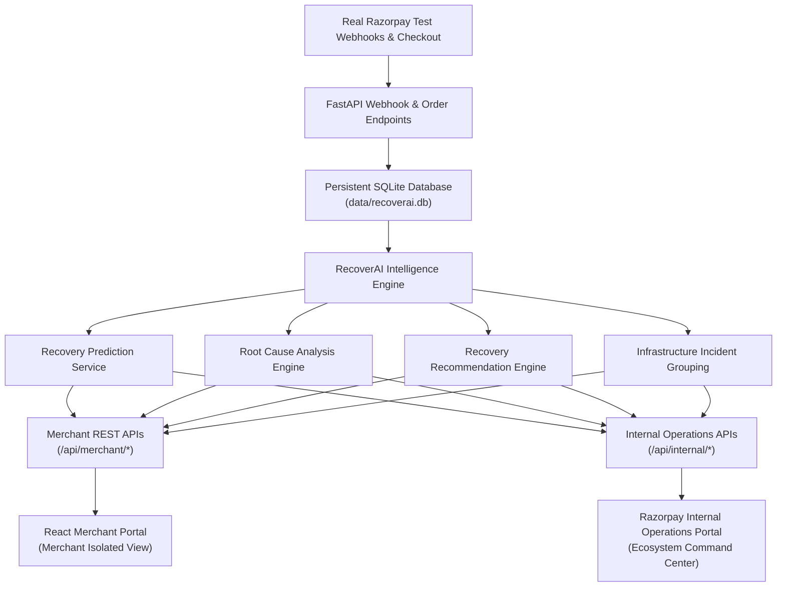

# RecoverAI — Autonomous AI Payment Recovery & Failure Intelligence Platform

**RecoverAI** is an AI-powered payment failure recovery and intelligence system built for Razorpay merchants and internal operations teams. Powered by a zero-leakage machine learning pipeline trained on transaction history, a deterministic Root Cause Analysis Engine, a dynamic Gateway Health monitor, and an Infrastructure Incident grouping pipeline, RecoverAI transforms digital payment failures into recovered revenue.

---

## 🌟 Key Product Capabilities

1. **ML Recovery Prediction Pipeline (`RandomForestClassifier`)**:
   - Predicts exact probability ($0.0 - 1.0$) and probability band (`High`, `Medium`, `Low`) that a failed transaction will be successfully recovered.
2. **Deterministic Root Cause Analysis Engine**:
   - Analyzes failure categories, error codes, gateway latency spikes, and merchant failure patterns to pinpoint the exact failure cause with weighted confidence scores ($85\% - 98\%$).
3. **Data-Driven Recovery Recommendation Engine**:
   - Evaluates historical success rates across 6 strategy choices (`Alternate payment method`, `Email reminder`, `OTP reminder`, `Retry after 10 minutes`, `Smart gateway retry`, `UPI payment link`) to recommend the optimal action.
4. **Single Source of Truth & Persistent SQLite Architecture**:
   - All live orders, real Razorpay Test Mode payments, ML predictions, recovery actions, and infrastructure incidents originate from SQLite (`data/recoverai.db`).
5. **Dual-Portal System Architecture**:
   - **Merchant Portal**: Client-facing workspace providing merchant-isolated payment recovery cases, live payment activity, denials diagnostics, and AI drawers.
   - **Razorpay Internal Operations Portal**: Operations command center monitoring ecosystem gateway telemetries, partner bank health, and aggregate recovery intelligence.

---

## 📐 Architecture & System Flow



---

## ⚙️ Environment Configuration

The backend and frontend are fully configurable via environment variables.

### Backend Environment Variables (`backend/.env`)

| Variable | Description | Default (Dev) | Example (Production) |
|---|---|---|---|
| `HOST` | Backend server bind IP address | `0.0.0.0` | `0.0.0.0` |
| `PORT` | Backend server port | `8002` | `8002` |
| `ENVIRONMENT` | Operating environment (`development` / `production`) | `development` | `production` |
| `ALLOWED_ORIGINS` | Comma-separated CORS allowed origins | `*` | `https://recoverai.yourdomain.com` |
| `FRONTEND_ORIGIN` | Explicit frontend origin for CORS | `http://localhost:5173` | `https://recoverai.yourdomain.com` |
| `RAZORPAY_KEY_ID` | Razorpay Test Mode Key ID | Configured | `rzp_test_...` |
| `RAZORPAY_KEY_SECRET` | Razorpay Test Mode Key Secret | Configured | `secret_...` |
| `RAZORPAY_WEBHOOK_SECRET` | Razorpay Webhook Secret for signature validation | Configured | `whsec_...` |
| `DATABASE_PATH` | Path to SQLite database file | `data/recoverai.db` | `/var/data/recoverai.db` |
| `DEMO_MODE` | Enables demo simulation APIs | `true` | `false` |

### Frontend Environment Variables (`.env`)

| Variable | Description | Default (Dev) | Example (Production) |
|---|---|---|---|
| `VITE_API_BASE_URL` | Base URL for backend API requests | `http://127.0.0.1:8002` | `https://api.recoverai.yourdomain.com` |

---

## 🚀 Local Development Setup

### 1. Backend Setup
```bash
# Navigate to backend directory
cd backend

# Install dependencies
pip install -r requirements.txt

# Copy environment template
cp .env.example .env

# Start FastAPI application
python -m uvicorn main:app --host 0.0.0.0 --port 8002 --reload
```
- API Endpoint: `http://127.0.0.1:8002`
- Health Check: `http://127.0.0.1:8002/health`
- API Docs (Swagger): `http://127.0.0.1:8002/docs`

### 2. Frontend Setup
```bash
# In project root
npm install

# Copy environment template
cp .env.example .env

# Start Vite development server
npm run dev
```
The application UI will open at `http://localhost:5173`.

---

## 📦 Production Build & Deployment

### 1. Build Frontend
```bash
npm run build
```
This compiles production assets into `dist/`.

### 2. Production Docker Deployment
```bash
docker compose up --build -d
```
- **Frontend Container**: Nginx serving static assets on port `80`
- **Backend Container**: FastAPI running Gunicorn/Uvicorn on port `8002`

---

## 🔒 Security, Webhooks & Merchant Isolation

1. **Secrets Security**: All Razorpay secrets (`RAZORPAY_KEY_SECRET`, `RAZORPAY_WEBHOOK_SECRET`) remain strictly backend-only. No secrets are ever exposed to the client or returned in API payloads.
2. **Webhook Signature Validation**: `POST /api/webhooks/razorpay` verifies HMAC SHA-256 signatures server-side.
3. **Webhook Idempotency**: Duplicate webhook payloads are recognized via `X-Razorpay-Event-Id` and ignored without duplicating payments or incident metrics.
4. **Merchant Domain Isolation**: Merchant queries enforce strict isolation. A request for a payment belonging to another merchant returns `404 Not Found`.
5. **Security Headers**: Injected automatically via FastAPI middleware (`X-Content-Type-Options: nosniff`, `X-Frame-Options: DENY`, `Referrer-Policy: strict-origin-when-cross-origin`).

---

## 🧪 Automated Testing & QA

Run all automated QA test suites:

```bash
# Security & Deployment Readiness Suite
py -3.11 backend/scratch/test_security_config.py

# Full Regression Suite
py -3.11 backend/scratch/test_api_error_states.py
py -3.11 backend/scratch/test_analytics_dynamic.py
py -3.11 backend/scratch/test_recovery_cases_dynamic.py
py -3.11 backend/scratch/test_recovery_lifecycle.py
py -3.11 backend/scratch/test_incident_grouping.py
py -3.11 backend/scratch/test_gateway_health_dynamic.py
py -3.11 backend/scratch/test_merchant_dashboard_dynamic.py
py -3.11 backend/scratch/test_phase9_internal_incidents.py
py -3.11 backend/scratch/test_phase8c_final.py
py -3.11 backend/scratch/test_phase10_failure_intelligence_consistency.py
```
