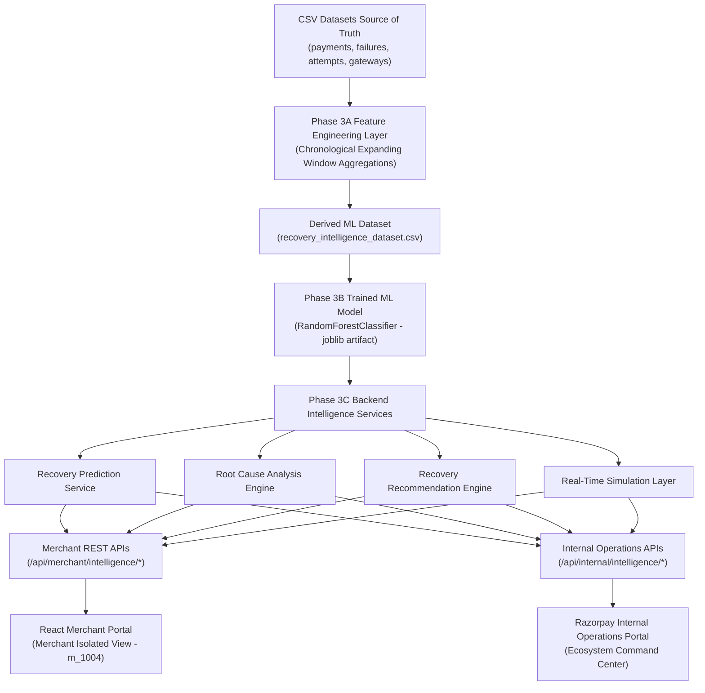

# RecoverAI — Autonomous AI Payment Recovery & Failure Intelligence Platform

**RecoverAI** is an AI-powered payment failure recovery and intelligence system built for Razorpay merchants and internal operations teams. Powered by a zero-leakage machine learning pipeline trained on transaction history, a deterministic Root Cause Analysis Engine, and a data-driven Strategy Recommendation Engine, RecoverAI transforms digital payment failures into recovered revenue.

---

## 🌟 Key Product Capabilities

1. **ML Recovery Prediction Pipeline (`RandomForestClassifier`)**:
   - Predicts exact probability ($0.0 - 1.0$) and probability band (`High`, `Medium`, `Low`) that a failed transaction will be successfully recovered.
   - Evaluated ROC-AUC: **`0.6443`**, Accuracy: **`0.6230`**, Brier Score Loss: **`0.2325`**.
2. **Deterministic Root Cause Analysis Engine**:
   - Analyzes failure categories, error codes, gateway latency spikes, and merchant failure patterns to pinpoint the exact failure cause with weighted confidence scores ($85\% - 98\%$).
3. **Data-Driven Recovery Recommendation Engine**:
   - Evaluates historical success rates across 6 strategy choices (`Alternate payment method`, `Email reminder`, `OTP reminder`, `Retry after 10 minutes`, `Smart gateway retry`, `UPI payment link`) to recommend the optimal action and top 2 alternatives.
4. **Dual-Portal System Architecture**:
   - **Merchant Portal**: Client-facing portal providing merchant-isolated payment recovery cases, denials diagnostics, and AI drawers.
   - **Razorpay Internal Operations Portal**: Operations command center monitoring ecosystem gateway telemetries, partner bank health, and aggregate recovery intelligence.

---

## 📐 Architecture & System Flow



---

## 🚀 One-Command Local Setup

### Prerequisites
- Python 3.10+
- Node.js 18+

### 1. Backend Setup
```bash
# Navigate to backend
cd backend

# Install dependencies
pip install -r requirements.txt

# Start FastAPI server
python -m uvicorn main:app --host 127.0.0.1 --port 8001 --reload
```
The API server will run at `http://127.0.0.1:8001`. Health check endpoint: `http://127.0.0.1:8001/health`.

### 2. Frontend Setup
```bash
# In project root
npm install

# Start Vite React development server
npm run dev
```
The application UI will open at `http://localhost:5173`.

---

## 🐳 Docker Deployment

To launch the full application (Backend + Frontend) in containerized production mode:

```bash
docker compose up --build
```
- **Frontend UI**: `http://localhost:80`
- **Backend API**: `http://localhost:8001`

---

## 🛡️ Security & Merchant Domain Isolation

- All merchant intelligence queries (`/api/merchant/intelligence/*`) enforce strict authorization checks:
  1. Validates `merchant_id` parameter against registered dataset merchants.
  2. Verifies payment ownership (`payment.merchant_id == merchant_id`).
  3. Returns `404 Not Found` if payment does not exist or belongs to another merchant.
- Prevents cross-tenant data leaks and payment ID enumeration.

---

## 🧪 Automated Testing & QA

Run the comprehensive master QA test suite:

```bash
python backend/scratch/test_phase6_hardening.py
```

Tests executed:
- `GET /health` system readiness check
- Real-time event simulation endpoints (`/api/demo/events`, `/simulate`, `/reset`)
- Merchant security & domain isolation 404 tests
- Internal operations telemetry endpoints
- ML prediction probability bounding & determinism
- Original CSV source dataset immutability assertion

---

## 📄 Hackathon Presentation Guide
For judge walkthrough steps, 30-second elevator pitch, and detailed demonstration notes, see [RECOVERAI_DEMO_GUIDE.md](file:///c:/Users/prath/OneDrive/Desktop/razorpau_final/RECOVERAI_DEMO_GUIDE.md).
