# RecoverAI Hackathon Demo & Presentation Guide

RecoverAI is an AI-powered Payment Recovery & Failure Intelligence Platform built for Razorpay merchants and internal operations teams. Instead of displaying static "Payment Failed" notifications, RecoverAI predicts recovery probabilities, explains underlying root causes, and recommends optimal automated recovery strategies to protect merchant revenue.

---

## 1. 30-Second Elevator Pitch
> *"Over 60% of digital payment failures in India are recoverable, yet merchants lose billions annually because traditional payment gateways provide no visibility into why transactions fail or how to recover them. **RecoverAI** transforms payment recovery into a science: using a zero-leakage machine learning model trained on transaction history, a deterministic Root Cause Engine, and a data-driven Strategy Recommendation Engine, RecoverAI recovers up to 35% of failed revenue while providing Razorpay ops teams with real-time gateway health telemetries."*

---

## 2. Technical Architecture & System Flow

```mermaid
graph TD
    A["CSV Source of Truth<br/>(payments, failures, attempts, gateways)"] --> B["Phase 3A Feature Engineering Layer<br/>(Expanding Window Historical Aggregations)"]
    B --> C["Derived ML Dataset<br/>(recovery_intelligence_dataset.csv)"]
    C --> D["Phase 3B ML Prediction Model<br/>(RandomForestClassifier - ROC-AUC: 0.6443)"]
    
    D --> E["Phase 3C Intelligence Services"]
    E --> F1["Recovery Prediction Service"]
    E --> F2["Root Cause Analysis Engine"]
    E --> F3["Recovery Recommendation Engine"]
    
    F1 & F2 & F3 --> G1["Merchant REST APIs<br/>(/api/merchant/intelligence/*)"]
    F1 & F2 & F3 --> G2["Razorpay Internal Operations APIs<br/>(/api/internal/intelligence/*)"]
    
    G1 --> H1["React Merchant Portal<br/>(Isolated Client View - m_1004)"]
    G2 --> H2["Razorpay Internal Portal<br/>(Ecosystem Command Center)"]
```

---

## 3. Key Technical Highlights

### 1. Zero-Leakage Machine Learning Model
- **Algorithm**: `RandomForestClassifier` (100 estimators, max depth 8).
- **Dataset**: 5,000 payment recovery cases (1 row = 1 payment case).
- **Features**: 18 engineered features across payment details, failure categories, gateway telemetry, and historical merchant performance.
- **Data Leakage Safeguard**: Merchant historical metrics (`merchant_historical_failure_rate`, `merchant_historical_recovery_rate`) are computed using chronological expanding window aggregations prior to each transaction timestamp.
- **Model Evaluation**:
  - **ROC-AUC**: `0.6443`
  - **Accuracy**: `0.6230`
  - **F1 Score**: `0.5652`
  - **Brier Score Loss**: `0.2325`

### 2. Deterministic Root Cause Analysis Engine
- Analyzes failure categories, error codes, gateway latency spikes ($>250$ms), gateway error rates ($>3.0\%$), and active incidents.
- Produces primary root cause titles, detailed human-understandable explanations, confidence scores ($85\% - 98\%$), and structured contributing factors.

### 3. Data-Driven Recovery Recommendation Engine
- Evaluates historical success rates across 6 strategy choices (`Alternate payment method`, `Email reminder`, `OTP reminder`, `Retry after 10 minutes`, `Smart gateway retry`, `UPI payment link`).
- Deterministic scoring formula:
  $$\text{recommendation\_score} = 0.40 \cdot \text{strategy\_hist\_success\_rate} + 0.35 \cdot P_{\text{ML}} + 0.15 \cdot S_{\text{compatibility}} + 0.10 \cdot \text{retryable}$$
- Ranks top strategy and returns top 2 alternative options.

---

## 4. Dual-Portal Architecture & Security Isolation

- **Merchant Portal (`/api/merchant/intelligence/*`)**:
  - Requires `merchant_id` parameter.
  - Strict security boundary: Querying a payment owned by another merchant returns `404 Not Found`.
  - Sanitizes internal gateway telemetry from client payloads.
- **Razorpay Internal Operations Portal (`/api/internal/intelligence/*`)**:
  - Ecosystem-wide aggregated operational intelligence command center.
  - Monitors partner bank health, failure spikes, and network recovery benchmarks.

---

## 5. Step-by-Step Hackathon Judge Demo Walkthrough

### Step 1: Merchant Dashboard
- Navigate to Merchant Portal -> Dashboard (`m_1004`).
- Point out **Revenue at Risk** (₹12.5L ecosystem total) and **Revenue Protected** via AI Smart Retries.

### Step 2: Failed Payment Inspection
- Navigate to Merchant Portal -> Payment Denials.
- Click payment `#pay_104421` to open the **AI Recovery Intelligence Drawer**.

### Step 3: AI Recovery Diagnostics Inspection
- **Recovery Probability**: Highlights `59.28%` ML prediction (`Medium Recovery Probability`).
- **Root Cause**: Shows `"Customer Checkout Session Drop-off"` (`89%` confidence).
- **Recommended Strategy**: Highlights `"OTP Reminder"` (`62.2%` AI Recommendation Score) and alternative options (`Email reminder`, `Retry after 10 minutes`).

### Step 4: Recovery Cases Pipeline
- Navigate to Merchant Portal -> Recovery Cases.
- Show active pipeline tracking from Payment Failure $\rightarrow$ AI Diagnostics $\rightarrow$ Retry Scheduled $\rightarrow$ Customer Contacted $\rightarrow$ Revenue Recovered.

### Step 5: Razorpay Internal Operations Command Center
- Switch top portal toggle to **Razorpay Internal Operations**.
- View **Ecosystem AI Command Center** (5,000 analyzed cases, ₹12.5L revenue at risk).
- View **Bank & Gateway Telemetry Grid** (Axis Wallet, HDFC, ICICI UPI, Razorpay, SBI Card).

---

## 6. Verification & Production Hardening Proof

- **Automated Master Test Suite**: `python scratch/test_full_hardening.py` (100% Passed).
- **Vite Production Build**: `npm run build` (0 Build Errors, compiled in ~360ms).
- **REST APIs Regression**: All 17 backend endpoints verified operational.
